<!-- AI ENGINEER PORTFOLIO README -->

<!-- HERO BANNER -->

<!-- TYPING ANIMATION -->

 

<!-- QUICK LINKS & SOCIALS -->

  
  
  

 

<!-- SYSTEM TELEMETRY -->

  

 

<table align="center" width="100%">
  <tr>
    <td width="50%" align="center">
      
    </td>
    <td width="50%" align="center">
      
    </td>
  </tr>
</table>

  

 

<!-- CORE ARSENAL & CLEARANCES -->

  

 

  

    
  

  

    
    
    
    
  

  

    
    
    
  

 

<!-- AI & SECURITY PROJECTS -->

  

 

<!-- BENTO GRID FOR PROJECTS -->
<table align="center" width="100%">
  
  <!-- ROW 1 -->
  <tr>
    <td width="50%" valign="top">
      <h3 align="center">🛡️ SafePush</h3>
      

        
        
      

      
<i>Security-gate ecosystem for detecting secrets, vulnerabilities, and risky AI code before pushing to CI/CD.</i>

      

        
      

    </td>
    <td width="50%" valign="top">
      <h3 align="center">🔍 Mini-SIEM AI</h3>
      

        
        
      

      
<i>Security platform combining Random Forest attack classification, SHAP explainability, and Groq LLM reasoning.</i>

      

        
        
      

    </td>
  </tr>

  <!-- ROW 2 -->
  <tr>
    <td width="50%" valign="top">
      <h3 align="center">🎣 Phishing Detector</h3>
      

        
        
      

      
<i>3-layer ML pipeline handling text, URL, and metadata analysis for multi-lingual zero-rule phishing detection.</i>

      

        
      

    </td>
    <td width="50%" valign="top">
      <h3 align="center">🎓 EduSathi</h3>
      

        
        
      

      
<i>AI tutor bridging RAG pipelines with curriculum PDFs for adaptive quizzes and student analytics.</i>

      

        
      

    </td>
  </tr>

  <!-- ROW 3 -->
  <tr>
    <td width="50%" valign="top">
      <h3 align="center">🏛 CampusIQ</h3>
      

        
        
      

      
<i>Smart campus platform with an integrated AI assistant, attendance, AES grievance encryption, and analytics.</i>

      

        
      

    </td>
    <td width="50%" valign="top">
      <h3 align="center">🧠 Synapse</h3>
      

        
        
      

      
<i>Adaptive AI study companion with Socratic interaction, voice capabilities, and local session persistence.</i>

      

        
      

    </td>
  </tr>

</table>

<!-- COMPACT GRID FOR ADDITIONAL PROJECTS -->
 
<table align="center" width="100%">
  <tr>
    <td width="33%" align="center">
      <h4>📄 ResumeAI</h4>
      
<i>LLM ATS scorer & docx rebuilder</i>

      
    </td>
    <td width="33%" align="center">
      <h4>🌐 Pollution Grid</h4>
      
<i>Geo-spatial modeling & 7-day anomaly</i>

      
    </td>
    <td width="33%" align="center">
      <h4>📚 StudentFlow AI</h4>
      
<i>AI mentor and productivity planner</i>

      
    </td>
  </tr>
</table>

 

  <code>root@muzzyy:~$ ./deploy_ai_models.sh && echo "Systems Online."</code>

<!-- FOOTER -->

  

